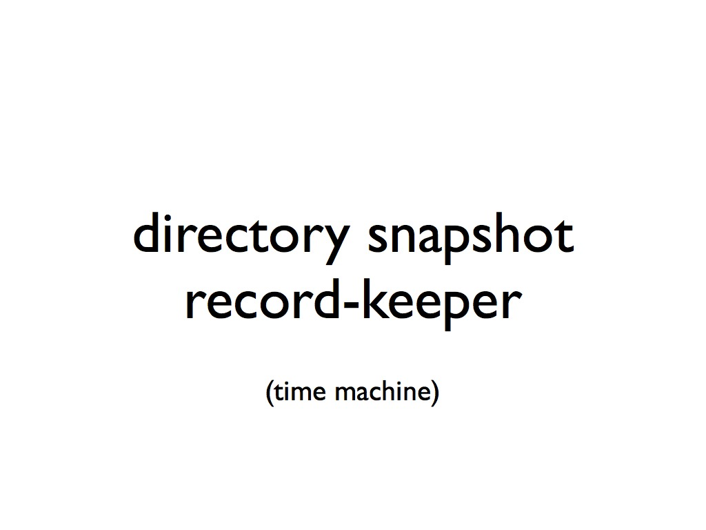
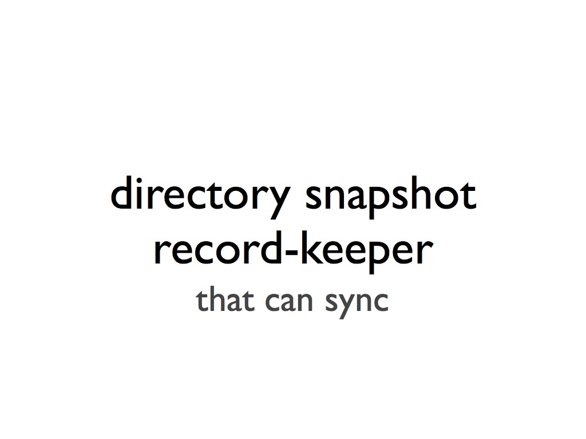
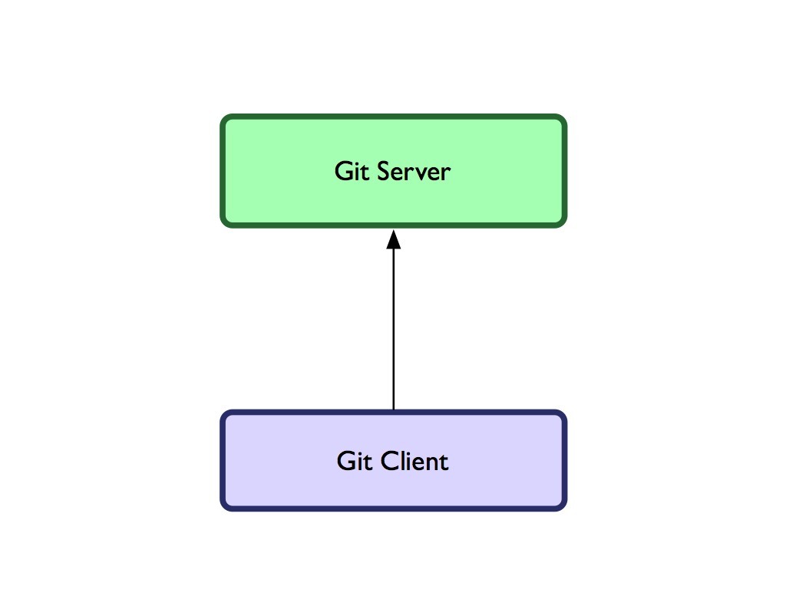
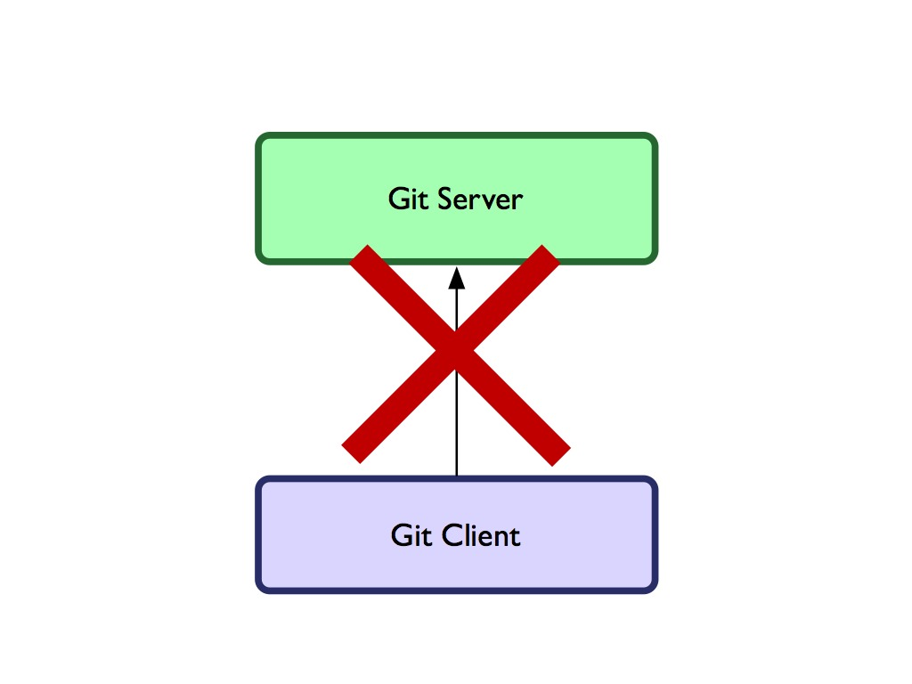
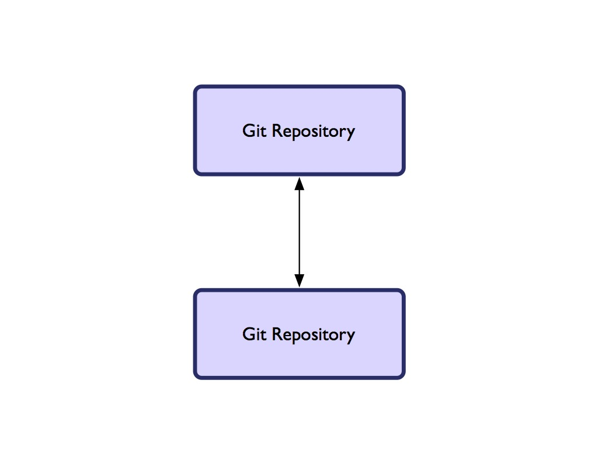
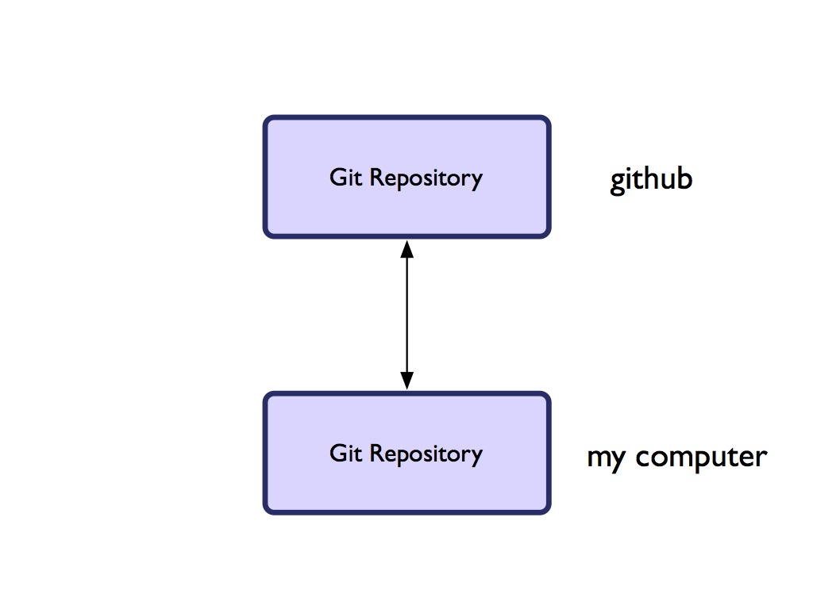
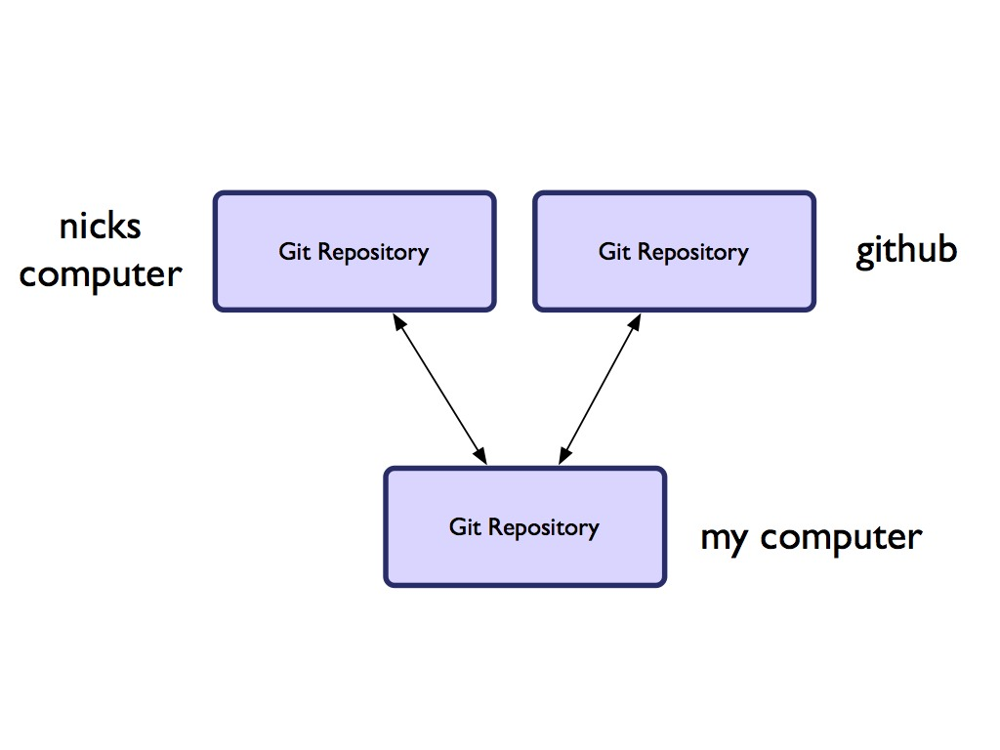
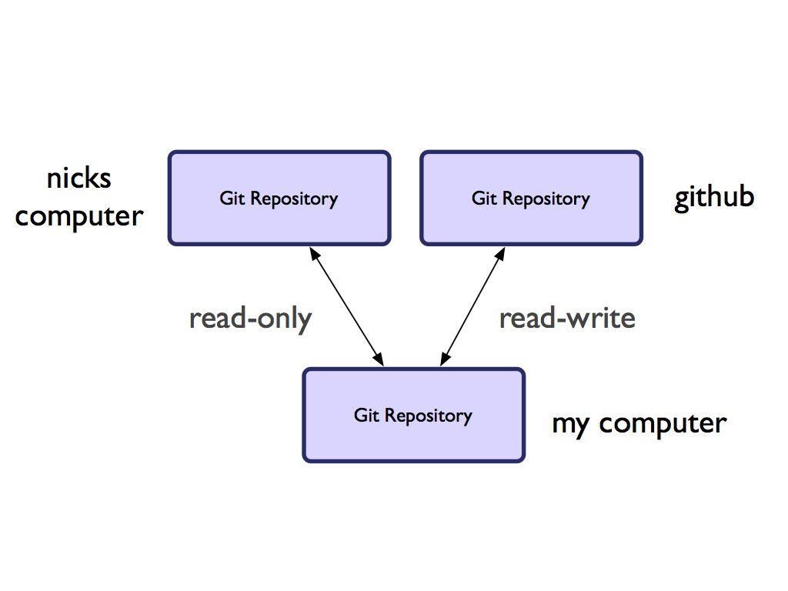

!SLIDE

# The Git Difference #

!SLIDE center

!SLIDE center

!SLIDE center

!SLIDE center

!SLIDE center

!SLIDE center

!SLIDE center

!SLIDE center

!SLIDE center

!SLIDE center

!SLIDE center

!SLIDE

# So, Git *really* is: #

!SLIDE

# a syncable database of directory snapshots #

