!SLIDE bullets

* Simple key/value content storage system
* Directory snapshot storage system

!SLIDE commandline incremental

	$ git update-index --add --cacheinfo 100644 35a0d my_readme
	$ git update-index --add --cacheinfo 100644 d6704 test.txt
	$ ls
	$ git ls-files
	my_readme
	test.txt
	$ git write-tree
	01d8cf040ddc3018a9f8f306ce97e20383e6faa1
	$ git cat-file -p 01d8cf040ddc3018a9f8f306ce97e20383e6faa1
	100644 blob 35a0dd3af166e09ac378dfeb959539	my_readme
	100644 blob d670460b4b4aece5915caf5c68d12f	test.txt
	$ git update-index --add --cacheinfo 100644 35a0dd README.txt
	$ git write-tree
	0cb48f3c9538c4e43c6d102308d9dd8331f19f37
	$ git cat-file -p 0cb48f3c9538c4e43c6d102308d9dd8331f19f37
	100644 blob 35a0dd3af166e09ac378dfeb959539	README.txt
	100644 blob 35a0dd3af166e09ac378dfeb959539	my_readme
	100644 blob d670460b4b4aece5915caf5c68d12f	test.txt

!SLIDE center
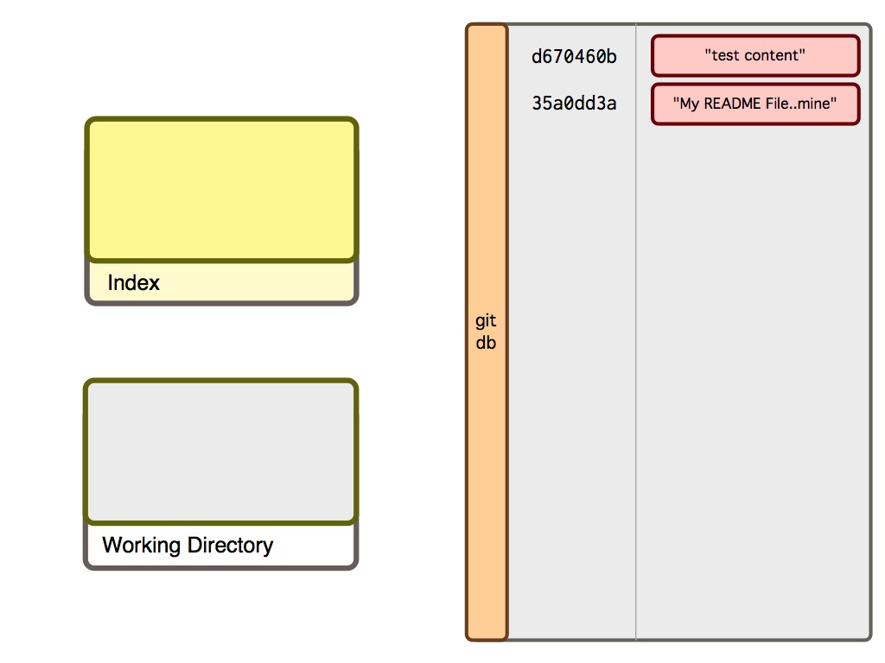

!SLIDE center
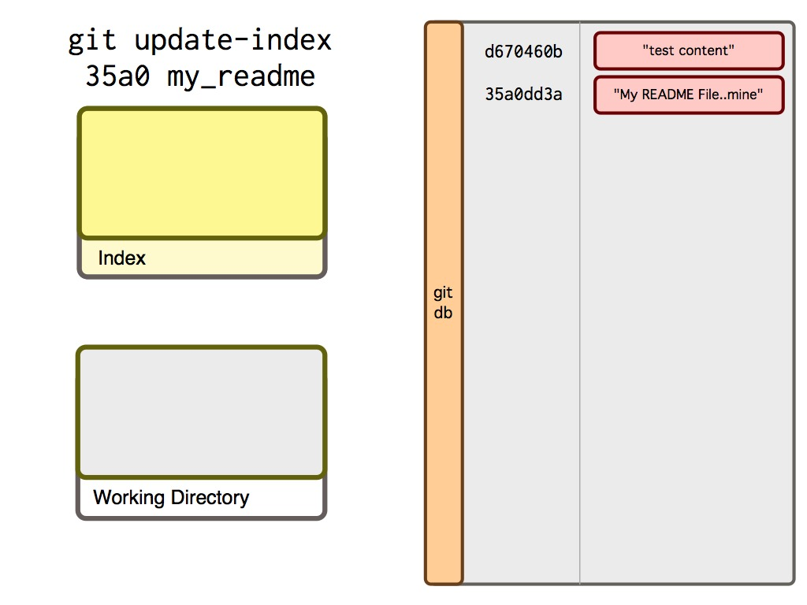

!SLIDE center
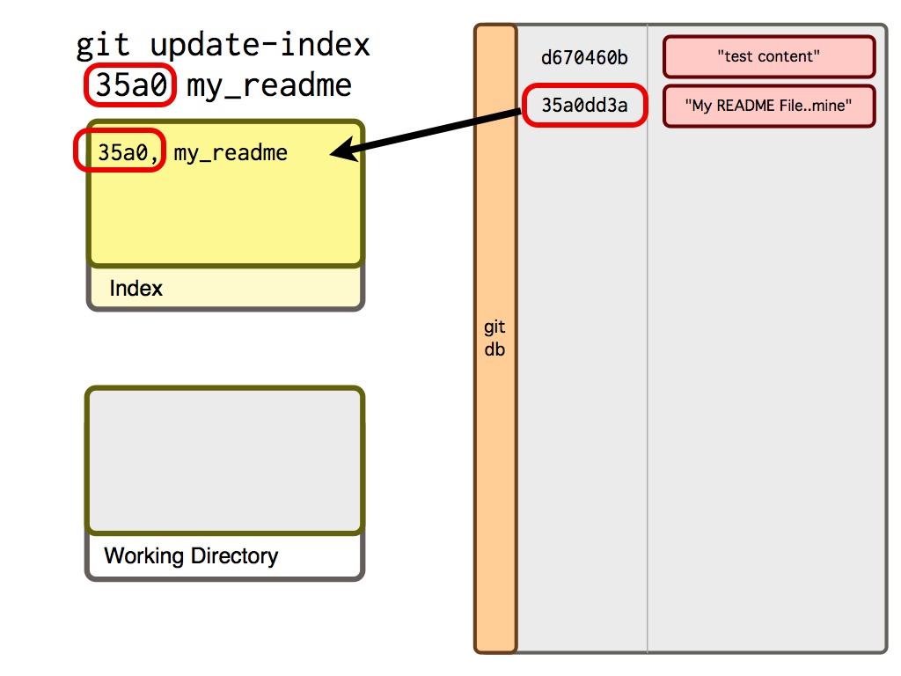

!SLIDE center
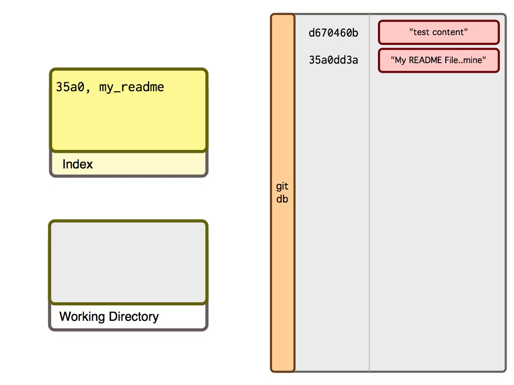

!SLIDE center
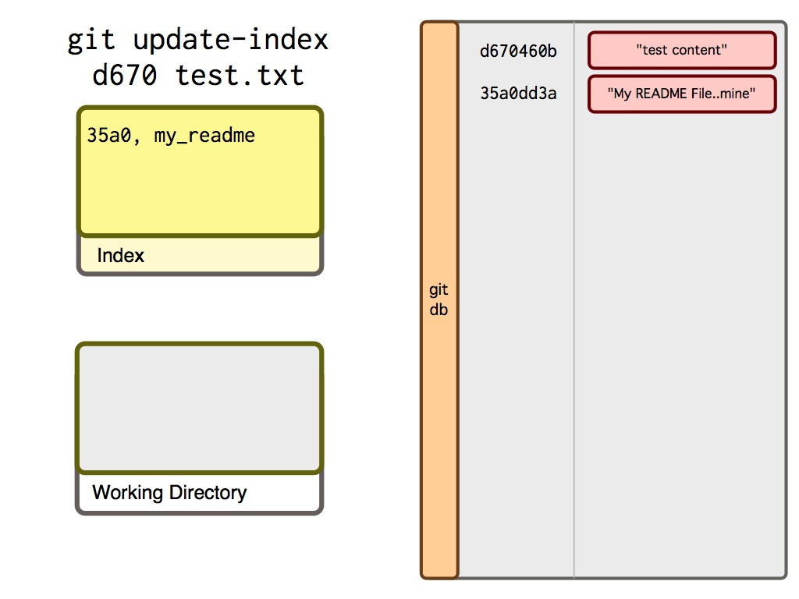

!SLIDE center
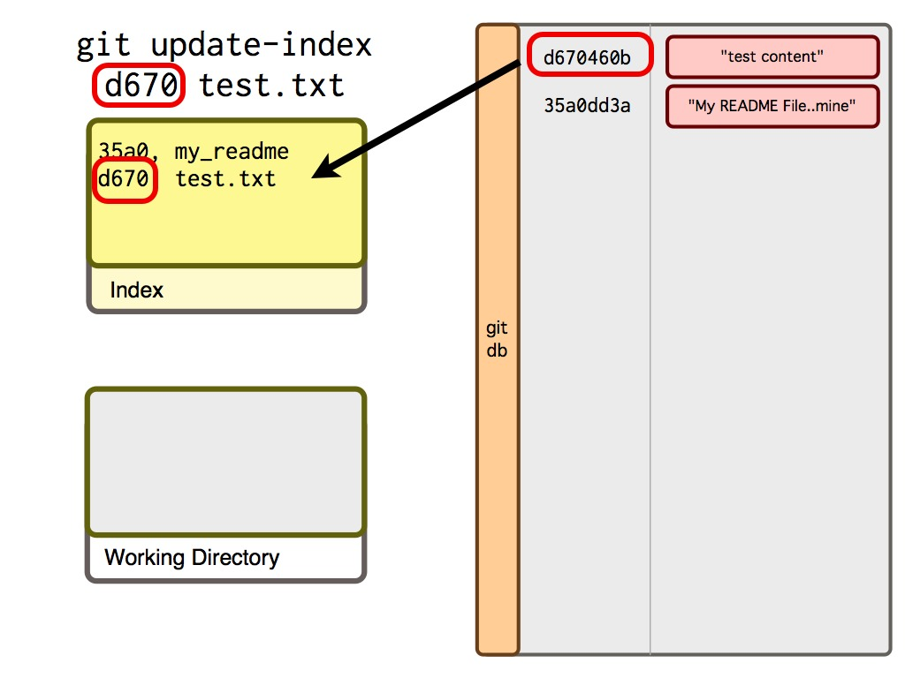

!SLIDE center

!SLIDE center
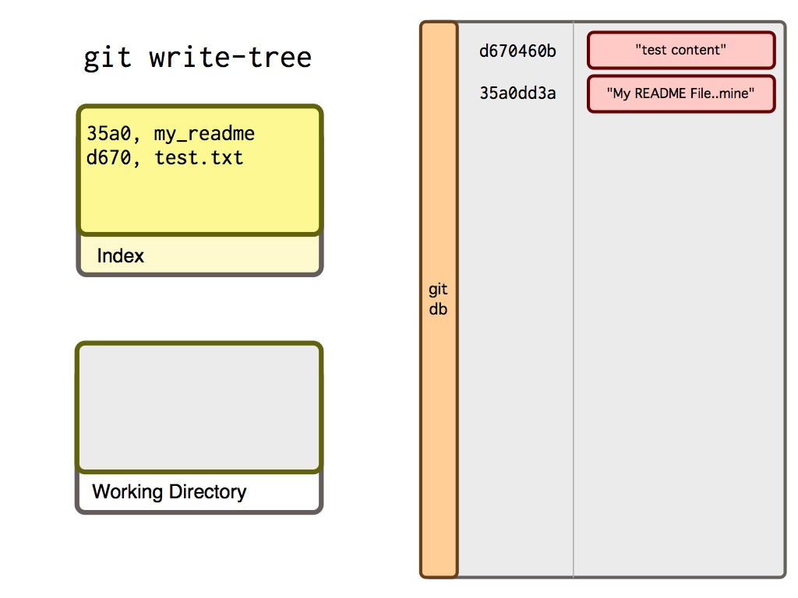

!SLIDE center
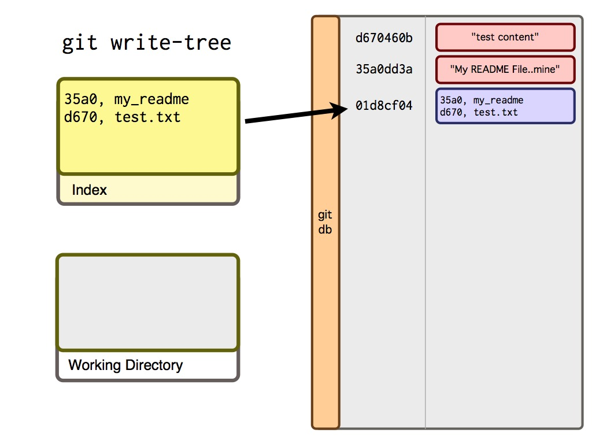

!SLIDE center
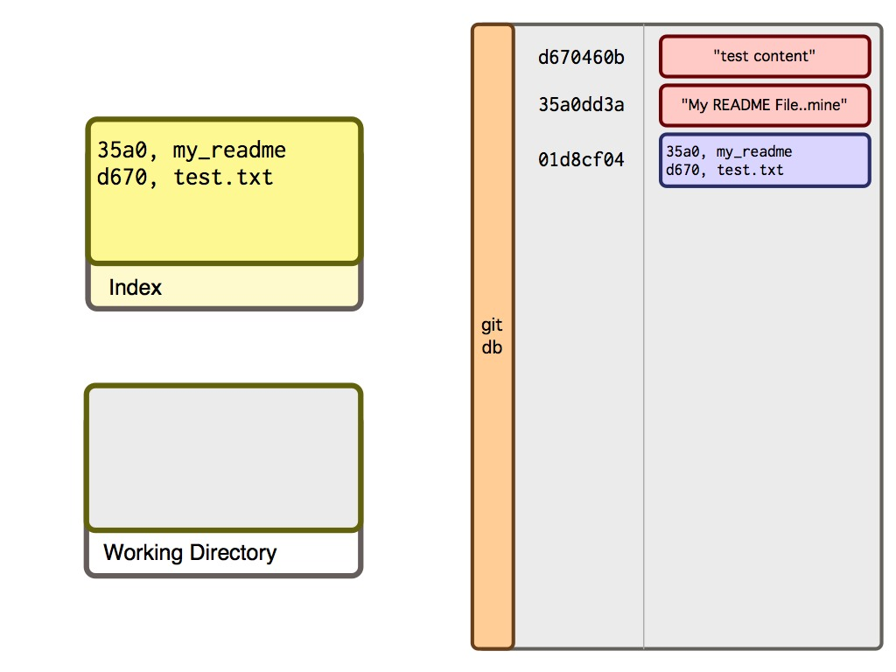

!SLIDE center

!SLIDE center

!SLIDE center
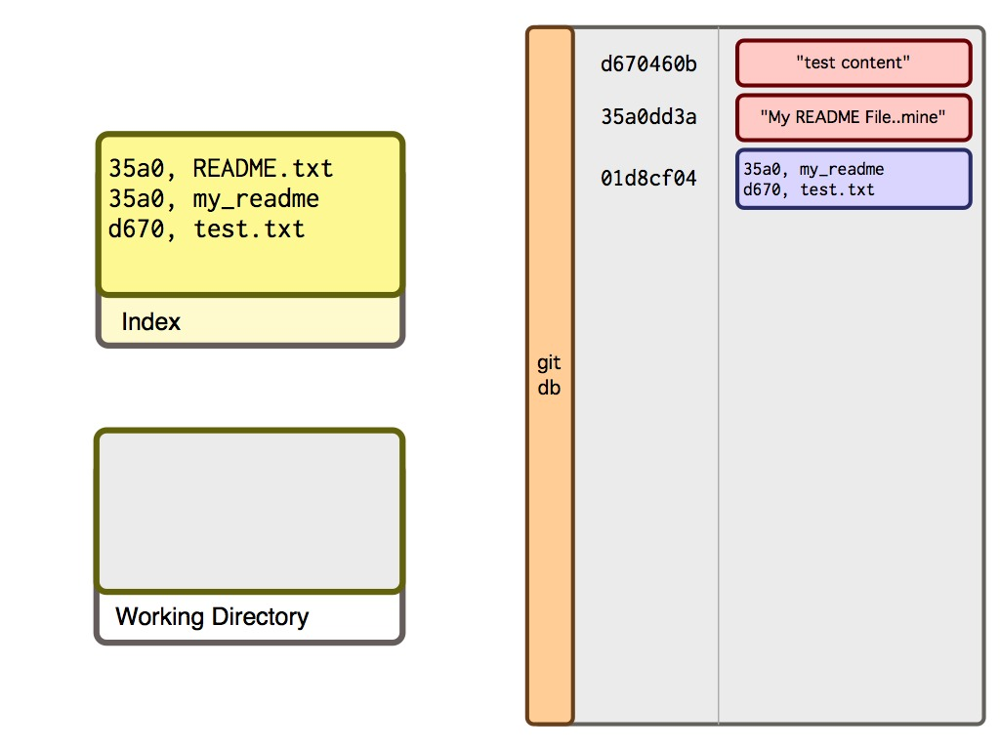

!SLIDE center
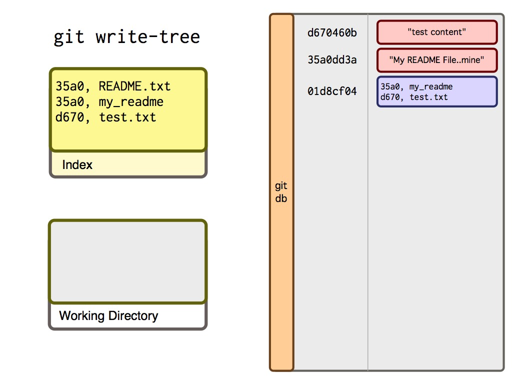

!SLIDE center
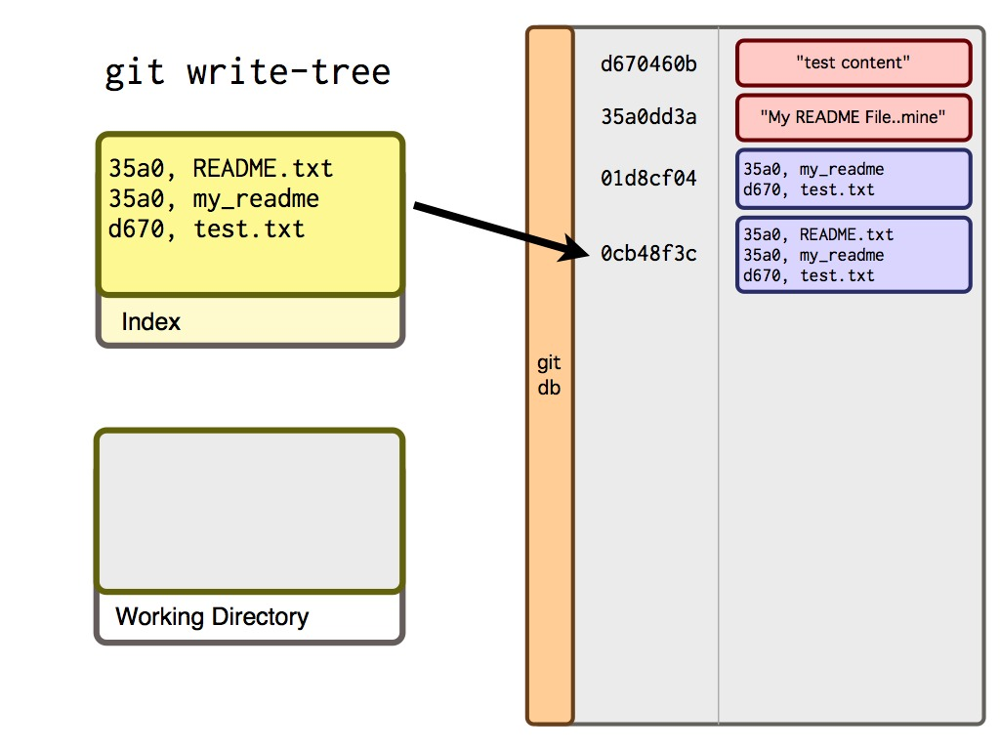

