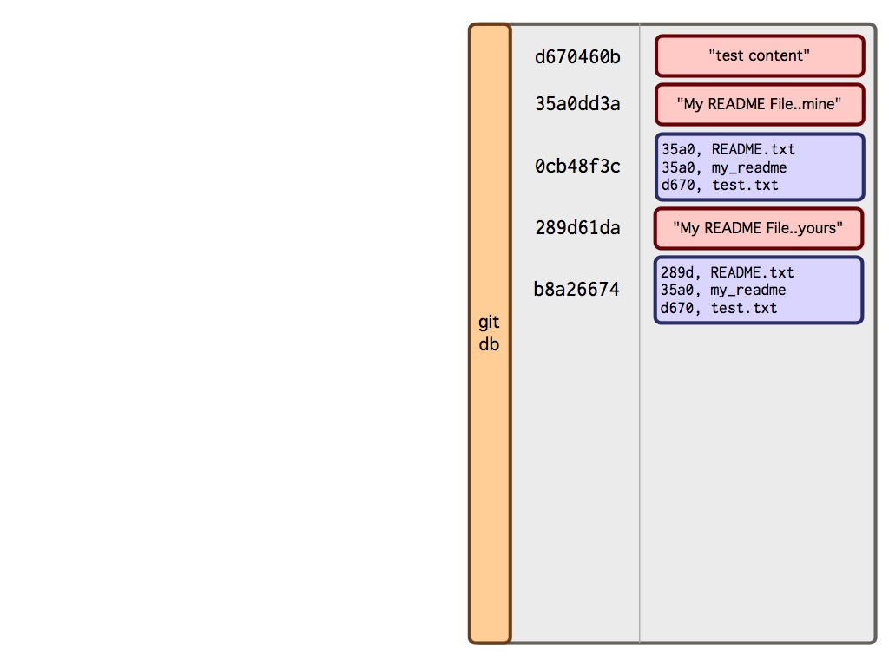
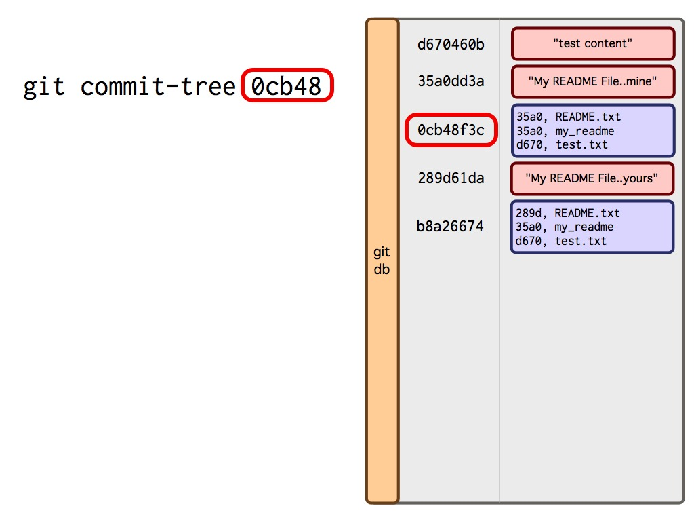
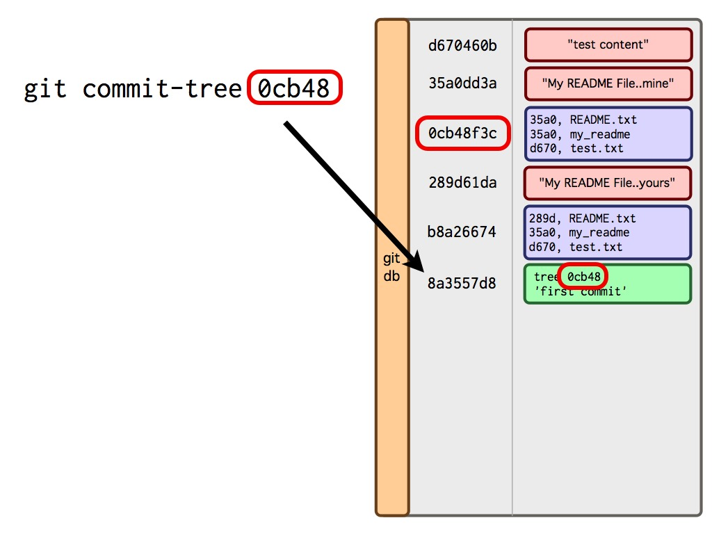
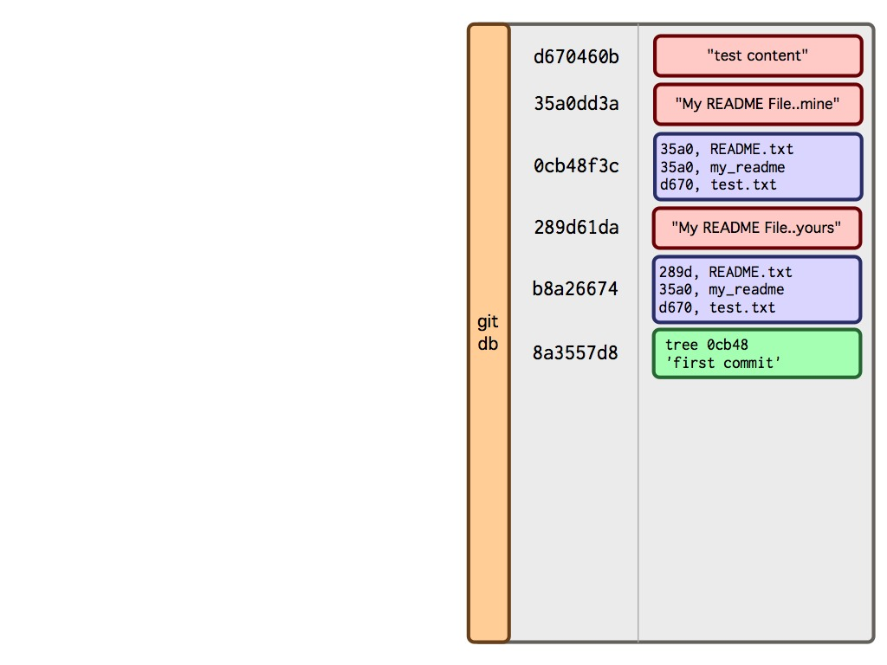
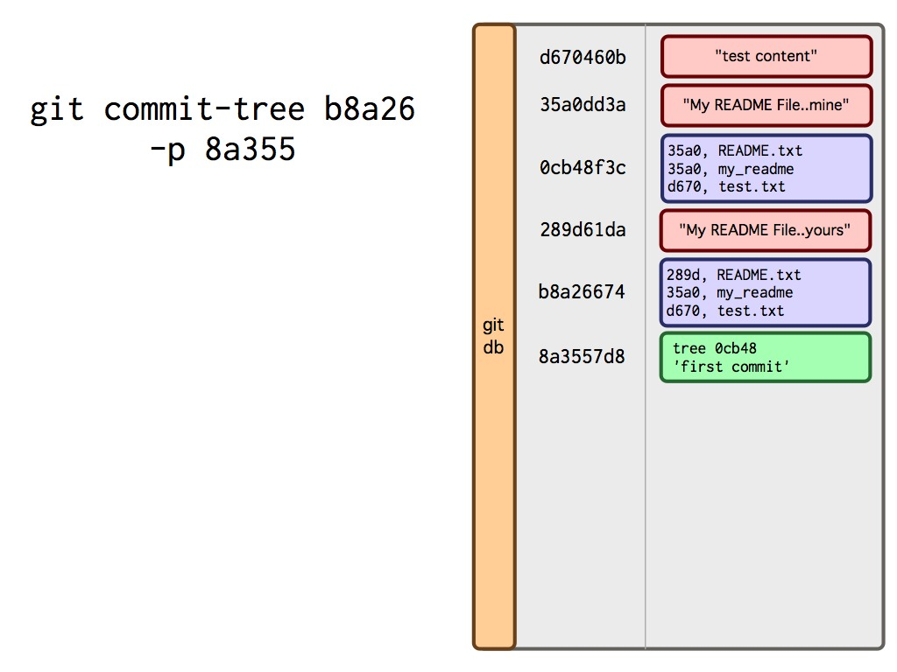
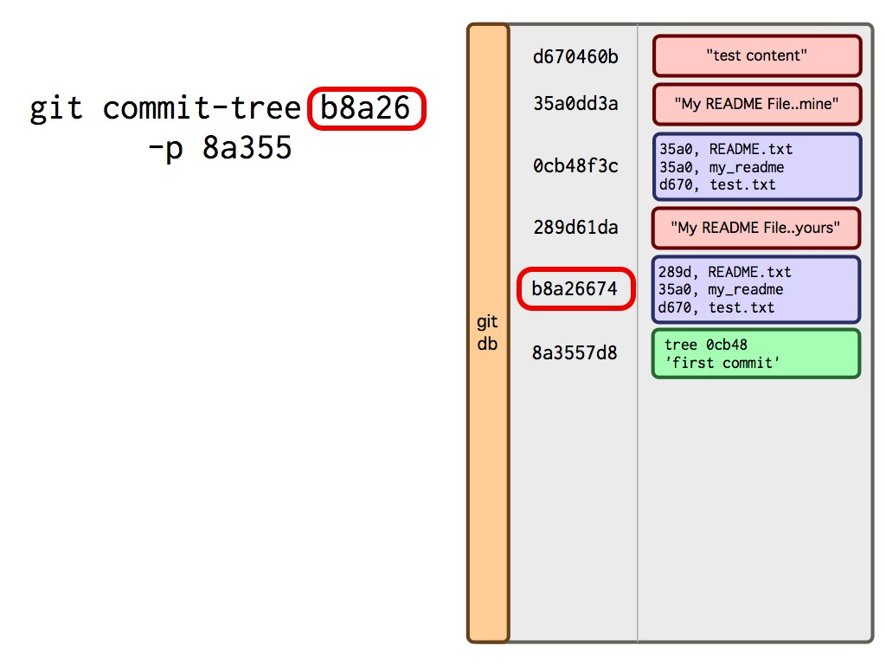
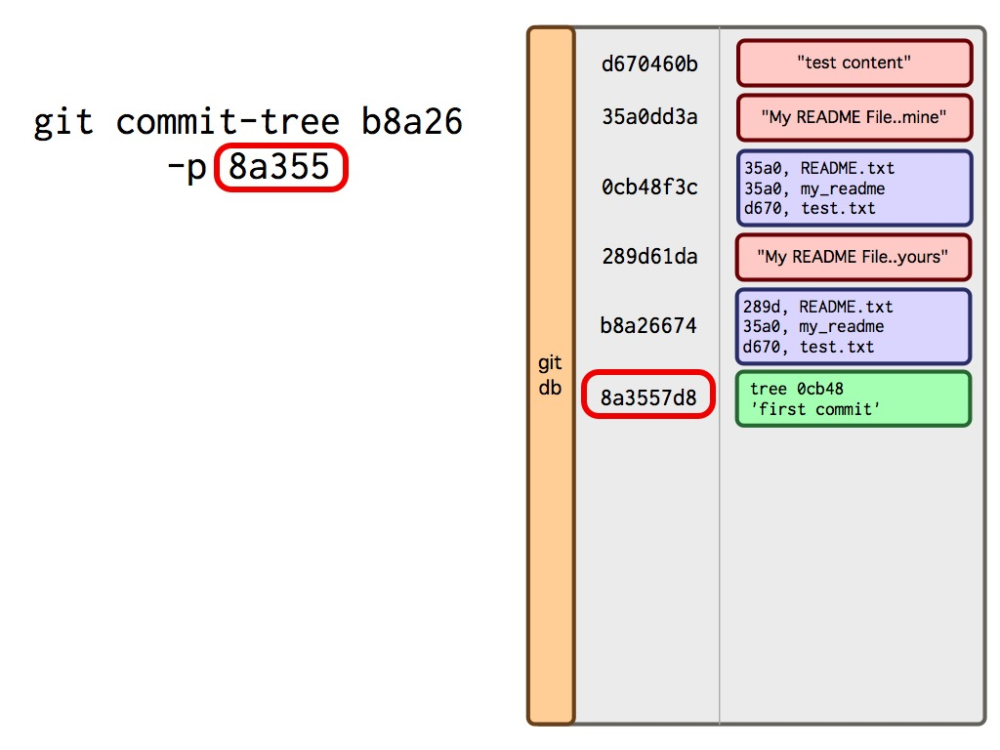
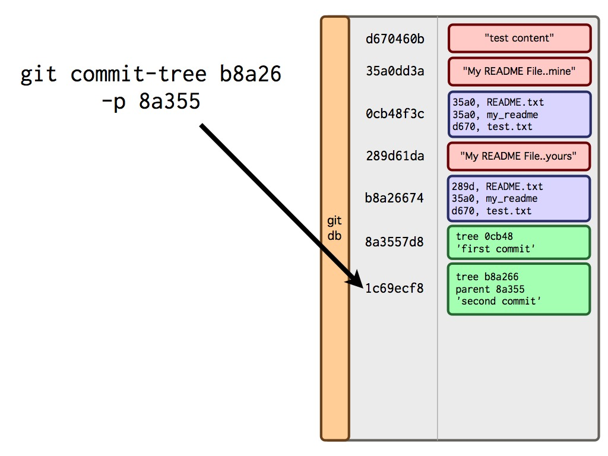
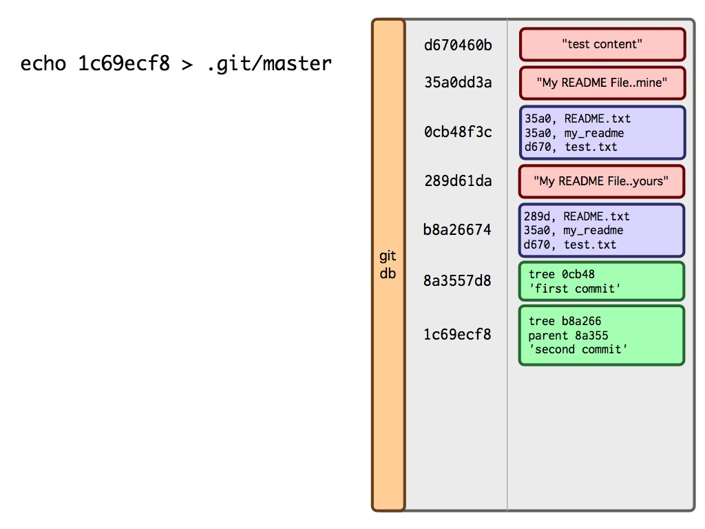
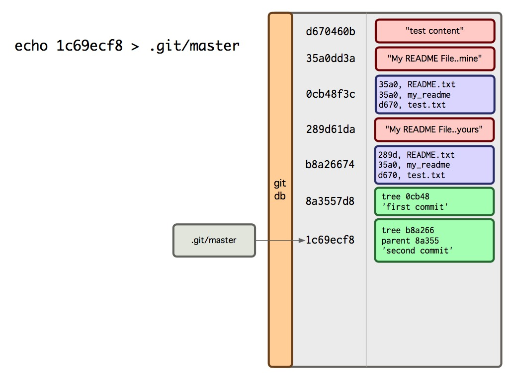

!SLIDE bullets

* Simple key/value content storage system
* Directory snapshot storage system
* History of directory snapshots system

!SLIDE commandline

$ TODO: STUFF

!SLIDE center

!SLIDE center

!SLIDE center

!SLIDE center

!SLIDE center

!SLIDE center

!SLIDE center

!SLIDE center

!SLIDE center

!SLIDE center

!SLIDE center

!SLIDE center

